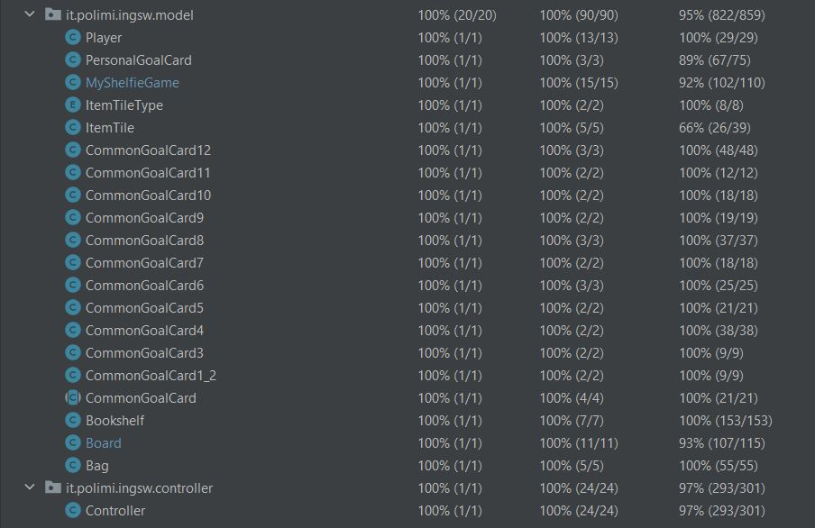

# **My Shelfie Game**
## **Introduzione**
Prova Finale del Progetto del corso d'Ingegneria del Software. Politecnico di Milano. AA 2022-2023. 

Il gioco è un'implementazione digitale del gioco in scatola My Shelfie di Cranio Creations s.r.l..

## **Autori**
Gruppo GC29:
* Pozzi Marco
* Reas Rebecca
* Pauselli Tommaso
* Rodella Filippo

Docente di riferimento: Cugola Gianpaolo

## **Funzionalità implementate**
Sono state implementate le seguenti funzionalità:

|              Funzionalità               |  Status  |
|:---------------------------------------:|:--------:|
|             Regole complete             |    ✔️    |
|                   TUI                   |    ✔️    |
|                   GUI                   |    ✔️    |
|                   RMI                   |    ✔️    |
|                 Socket                  |    ✔️    |
| Funzionalità avanzata: Partite multiple |    ✔️    |
|   Funzionalità avanzata: Persistenza    |    ✔️    |

## **Utilizzo del JAR**
Il gioco è diviso in due file jar, che possono essere trovati nella cartella [shade](https://github.com/MarcoPozzi29/ing-sw-2023-pozzi-reas-pauselli-rodella/tree/main/shade):
* `Client-softeng-gc29.jar`
* `Server-softeng-gc29.jar`

### **Server**
Per la corretta esecuzione del server, si dovranno inserire tre parametri ordinati assieme al comando di esecuzione sulla console:
1. L'indirizzo IP esposto dal server (per scambi RMI)
2. La porta su cui eseguire il server RMI
3. La porta su cui eseguire il server Socket

Quindi:

`java -jar Server-softeng-gc29.jar ip_server RMI_port Socket_port`

Ad esempio, se l'indirizzo del server è 192.168.1.1, e si desidera avviare RMI sulla porta 7654 e Socket sulla porta 4567, in console dovrà essere scritto il seguente comando:

`java -jar Server-softeng-gc29.jar 192.168.1.1 7654 4567`

All'avvio del Server, verrà creata una cartella Persistence, che verrà utilizzata per il salvataggio su disco dei file utili per la funzionalità avanzata della persistenza.

### **Client**

Per la corretta esecuzione del client, si dovranno inserire tre parametri ordinati assieme al comando di esecuzione sulla console:
1. L'indirizzo IP del client
2. L'indirizzo IP del server a cui ci si vuole collegare
3. La porta del server su cui accedere

Quindi:

`java -jar Client-softeng-gc29.jar ip_client ip_server server_port`

Ad esempio, se l'indirizzo del client è 192.168.1.2, l'indirizzo del server è 192.168.1.1 e si desidera accedere alla porta 4567, in console dovrà essere seguito il seguente comando:

`java -jar Client-softeng-gc29.jar 192.168.1.2 192.168.1.1 4567`

All'avvio del client verrà richiesta di scegliere l'interfaccia desiderata (TUI o GUI) e la tecnologia desiderata (Socket o RMI)

## **Copertura dei test**

Di seguito si possono visualizzare degli screenshot effettuati su IntelliJ IDEA per quanto riguarda la copertura dei test:

* Copertura dei metodi del model: 100%
* Copertura delle linee del model: 95%
* Copertura dei metodi del controller: 100%
* Coperuta delle linee del controller: 97%

## **File del Progetto**

Ecco il contenuto delle varie cartelle caricate:
* [persistence](https://github.com/MarcoPozzi29/ing-sw-2023-pozzi-reas-pauselli-rodella/tree/main/Persistence): salvataggio su disco delle partite interrotte da un crash del server.
* [deliverables](https://github.com/MarcoPozzi29/ing-sw-2023-pozzi-reas-pauselli-rodella/tree/main/deliverables): Peer Review, UML, Sequence Diagram, JavaDoc, Slide finali di presentazione.
* [resources](https://github.com/MarcoPozzi29/ing-sw-2023-pozzi-reas-pauselli-rodella/tree/main/resources): file utili per la creazione della Board, delle Personal Goal Card e degli ItemTile, assieme alle immagini usate per la GUI.
* [shade](https://github.com/MarcoPozzi29/ing-sw-2023-pozzi-reas-pauselli-rodella/tree/main/shade): jar del server e del client
* [src](https://github.com/MarcoPozzi29/ing-sw-2023-pozzi-reas-pauselli-rodella/tree/main/src): codice Java del progetto